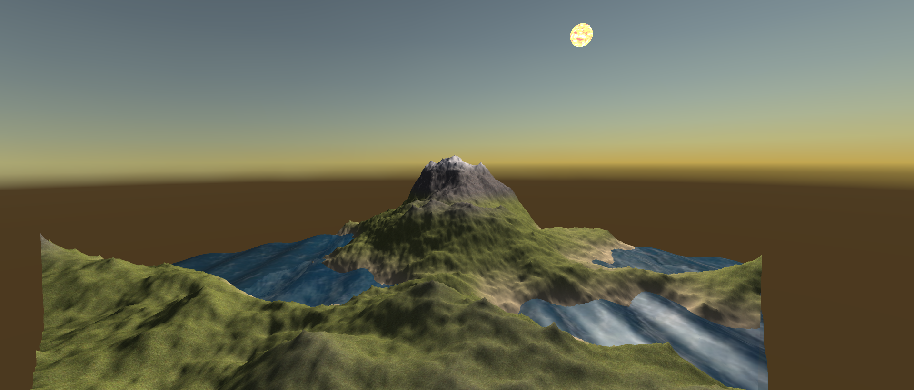
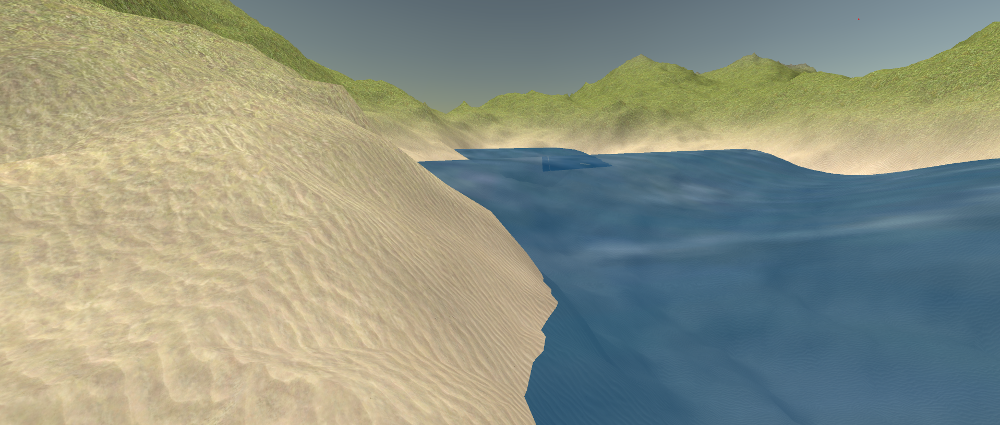
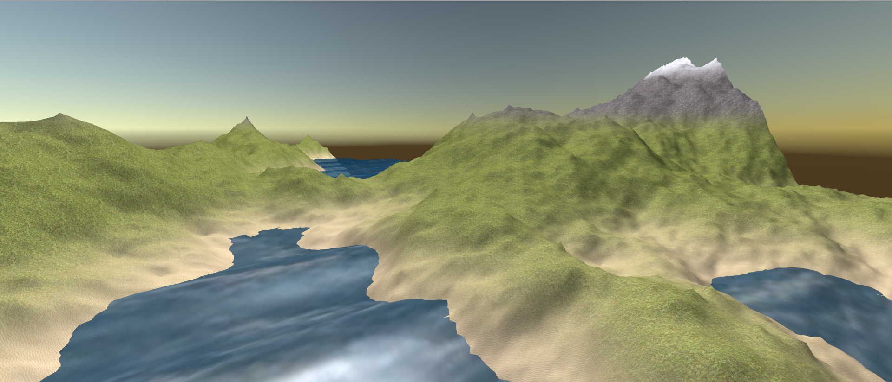

# Fractal Landscape
## Table of contents
* [Team Members](#team-members)
* [Technologies](#technologies)
* [How to Run](#how-to-run)
* [Introduction](#introduction)
* [Diamond-Square implementation](#diamond-square-implementation)
* [How Geometry of Terrain is Generated and Represented](#geometry-of-terrain)
* [Transformation Used to Facilitate Camera Motion](#transformation-used-to-facilitate-camera-motion)
* [Justification for Parameters in Phong Illumination model to achieve Realistic Surface Properties for both Terrain and Water](#parameters-in-phong-illumination-model)
* [Vertex Shader Implementation to achieve a Realistic Wave Effect](#vertex-shader-implementation---waves)

## Team Members

| Name | Task | Status |
| :---         |     :---:      |          ---: |
| Andrew Naughton  | Diamond Square, Initial Camera Position, Code Organisation, README     |  Complete|
| David Naughton    | Diamond Square, Phong Illumination, Vertex Shader, Waves, Texture Blending, README  |  Complete|
| Jiseong Oh    | Camera Motion, Camera Boundary Setting, Sun Rotation  |  Complete|

## Technologies
Project is created with:
* Unity 2019.4.3f1

## How to Run
1. Clone this repository
2. Import root directory into Unity Hub
3. Open `Scenes/SampleScene.unity` in Unity Editor.
4. Press play.
5. Press `space` to generate a new random terrain in Game Mode.
6. Enjoy!

## Introduction
>## Task
> Use fractals to automatically generate a 3D landscape, and enable a user to navigate around the landscape in a `flight simulator` style.

In this project, our team explored how to procedurally generate a fractal landscape using the Diamond Square Algorithm. We made use of the following (*not exhaustive*):

- Shaders
- Texture Blending and Tiling
- Phong Illumination
- Camera motion
- Wave effect

### The Result
We present to you our terrain!
<p align="center">
  
</p>

<p align="center">
  
</p>

<p align="center">
  
</p>

## Diamond-Square implementation

- Our Diamond square algorithm takes a list of vertices which represent a 2D `x`, `z` square mesh and sets the height `y` of each vertex.

- We start by setting the height of the four corners of the mesh to a random value between `[-maxHeight, +maxHeight]`:

	```c#
	// initialise the four corner heights
	vertices[0].y = Random.Range(-maxHeight, maxHeight);
	vertices[terrainPartitions].y = Random.Range(-maxHeight, maxHeight);
	vertices[nVertices - terrainPartitions + 1].y = Random.Range(-	maxHeight, maxHeight);
	vertices[nVertices - 1].y = Random.Range(-maxHeight, maxHeight);
	```

- The way we iterate is to start with one square representing the whole mesh. Next, we split the square into 4 equal squares, each with half the partitions of the initial square. We repeat this until the square partitions is 1, which is where we finish as the square has no internal vertices.
- Since we are repeatedly halving the partitions all the way down to 1, this means the number of iterations is:
	```c#
	int steps = (int) Mathf.Log(terrainPartitions, 2);
	```
- For example, if you started with an `8 * 8` partition square, at the next step you have 4 `4 * 4` squares, then 16 `2 * 2` squares, which is where we stop.

- After each iteration we will reduce the original `height` value by a constant factor `heightDecayRate = 0.475` to provide smoothness to the heights:
	```c#
	height *= heightDecayRate;
	```
- We now loop through each square and pass the row and column of the vertex at the bottom left corner of the square, as well as the number of partitions in the square and the decaying-height to the diamond step function.

- To perform the diamond step, we use the position of the bottom left vertex and partitions of the square to find the positions of the other three corners of the square in the vertex array. We average the heights of all these to get the height of the vertex in the middle. Code snippet:

	```c#
	void  diamond(int row, int column, int size, float height) {
		int bottomLeft =  getVertexPosition(row, column);
		int bottomRight = bottomLeft + size;
		int topRight =  getVertexPosition(row + size, column + size);
		int topLeft = topRight - size;
		int middle = (int) (0.5f  * (bottomLeft + topRight));
	
		// diamond step
		int[] squarePoints =  new  int[] {bottomLeft, bottomRight, topLeft, topRight};
		vertices[middle].y =  averageHeight(squarePoints) + Random.Range(-height, height);
	}
	```

- We apply the diamond step to each square first, because the square steps rely on the diamond step height calculations for the `outside vertex`.
- To perform the square step, we pass the same parameters as above in diamond step. We must find the height of four vertices in this step and for each one we average the height of the two closest corners of the square, the middle and, if it exists, the `outside vertex`. The outside vertex is a middle vertex from a neighbouring square. We check whether the row and column of the outside vertex is within the limits of the 2D mesh and if not then we ignore it (see code snippet). This means for square step vertices on the boundaries of the 2D mesh the height will only be the average of three points, for all non-boundary square steps vertices it will be the average of 4.
	```c#
	private  bool  checkOuterPoint(int position) {
		if (position >=  0  && position <= terrainPartitions)
			return  true;
		else
			return  false;
	}
	```

- Once we have performed the square step for all squares then we return to outer loop and divide again into smaller squares and repeat until we are done.

## Geometry of Terrain

- The Mesh class is used to store and represent the geometry of our terrain in Unity. It contains several data structures which are required to render an object. The simplest to understand is the vertices list. This is a 1D list of vertices each of which is a Vector3 object whose components `x`, `y`, ` z` represent a coordinate position in model space. Model space is a 3D Euclidian space which is local to the given object. Our terrain has `terrainPartitions` partitions of square length `terrainLength`. Our vertices array has length `(terrainPartitions + 1) * (terrainPartitions + 1)`. We chose the convention that our first vertex would start at `(0, y, 0)` and go along the `x` (row) axis first before moving to the next `z` (column).

- The mesh needs to have a representation in terms of triangles. We need to define the triangles data structure which is a 1D list of integers which the mesh uses as references to the vertices list. Each set of three successive points defines a triangle and the order of the three is important because that defines the winding order. For the terrain we define our triangles so that each `square` (at the smallest scale) in the vertices list has two triangles. This means that our triangles will share vertices. Since we know each triangle has 3 vertices, each square has two triangles and there are `terrainPartitions * terrainPartitions` squares in our mesh we can calculate the length of the triangle list as the product of these terms. The winding order is clockwise when looked upon from a bird’s eye view, since the camera is always above the terrain (and water) this means we can cull the anti-clockwise triangles and save some computation.

- To define how the Mesh interacts with lighting, we need to define Mesh normals. Normals are the points perpendicular to the mesh surface. A Mesh requires one normal defined for each vertex (pointing outward from the rendered side of the surface). Since we are working in 3D space this means we need to work out the two orthogonal tangent vectors to the surface (aka. tangent vector and binormal vector) and then take the cross product to get the normal vector.

- Luckily, the Mesh class has an inbuilt function called `RecalculateNormals()` which does this work for us.

- To cover a mesh in a texture there is an additional Mesh data structure which we need to use. UV coordinates tell the Mesh how to map a square texture which spans the unit square (i.e. `(0,0)` to `(1,1)`) to the vertices of the Mesh. Since our terrain is a square, we interpolate the row and column of each vertex into the unit square. For example, if we had a `4 * 4` terrain we would map vertex at `(1,3)` to `(1/4, 3/4)`.

- Once we set this data structure in the Mesh, Unity will send the Mesh to the GPU for shading. There, it will get transformed using the `MVP` matrix to view space and we will see a nice terrain appear!

## Transformation Used to Facilitate Camera Motion

- The flying camera uses input from the `a`, `w` ,`d`, `s` keys to move left, forward, right and back respectively. This movement is relative to the current pitch and yaw which are rotations in the `x` and `y` axes, respectively.

- The goal of our initial camera position is to view the middle of the terrain from a height such that the landscape is clearly visible.

- Since our default starting position is in the corner of the map (i.e. `x = 0`, `z = 0`), yaw is initialised to 45 degrees. This means our view is toward the opposite corner of the terrain. The starting `y` value is based on the `max height of the terrain + buffer`. The initial pitch angle directs the camera down at the centre of the terrain, and is solved as follows:
	```c#
	float angle = 180 * Mathf.Atan(y / (0.5f * terrainLength)) / Mathf.PI;
	```

- When `Update()` is called we capture `Input.GetAxis` for the `x`, ` y` coordinates of the mouse. 

- First we multiply these by `rotationSpeed` and then we add the `x` coordinate part to the previous yaw value and subtract the `y` part from the previous pitch value. The pitch is subtracted rather than added because we use the convention that moving the mouse up will point the camera at the sky. This is because unity uses left hand coordinate system so positive rotation around `x` axis pushes pitch down and hence negative pushes it up.

- We also set limits on the pitch so that the camera cannot over rotate and end up doing a backflip which would be disorientating for the user. Finally, we assign the new pitch and yaw to `transform.eulerangles` which is a bit simpler to understand than working with quaternion rotations (unity converts Euler angles to quaternion rotation for us). This gives the camera smooth rotation based on the mouse screen position.

- The way we achieve motion left, forward, right and back is to capture input from the `a`, `w`, `d`, `s` keys at every `Update()` through `Input.GetAxis` Horizontal and Vertical components. We multiply these components by a movement speed parameter and then we use `transform.Translate` to move left and right (horizontally) and forward and back (vertically) relative to the current camera rotation.

- In order to enforce camera boundaries in the `x`, `z` plane, we check the `x`, `z` coordinates every update. If the camera tries to move beyond the limits of the terrain in the `x`, `z` plane (less a buffer for safety) we reposition the camera back to where it was prior to the attempted movement.

- Similarly, for the `y` direction we check the `y` coordinate every update against the height of the terrain (or water) at the nearest `x`, `z` vertex position (plus a buffer for safety). If the camera tries to go beneath the terrain or water then we will reposition the camera back to where it was prior to the attempted movement.

<p align="center">
  
</p>

## Parameters in Phong Illumination Model

- The Phong illumination model breaks the illumination of an object down into three components: `ambient`, `diffuse` and `specular`. Ambient light is the base amount of light in the scene. Diffuse is the light that is reflected off the surface of an object in all directions. Specular is the light that hits the surface and is reflected towards the camera. The specular highlights which appear on the surface of the object from the perspective of the camera can be either large and dull or small and intense. This is what we refer to as `shininess`.

- How an object appears according to the camera is the sum of the three components. In order that an object does not appear brighter than the light incident on it, the sum of the weights of `diffuse` and `specular` light should not exceed 1.

- The surfaces' physical properties determine the weight of `diffuse` vs `specular` light, as well as the `shininess`.

- Because typical terrain surfaces such as grass, rock and sand are quite rough, the light which strikes them will bounce around in lots of different directions and so will appear more `diffuse` than `specular`. They will also have low `shininess`.

- Soft snow will be `diffuse` as well because snowflakes are fractal objects with intricate surfaces, however smooth ice will be more `specular`. We have assumed the snow on the terrain is `diffuse` consistent with the rest of the terrain textures.

- Water on the other hand is mostly a smooth surface except for crashing waves. When light hits a smooth surface, it will be absorbed or reflected, when the light reflected hits the camera it will produce a `specular` highlight. Hence water will be more `specular` than `diffuse`, and more shiny than the terrain.

## Vertex Shader Implementation - Waves

- The Vertex Shader for water is where we implement the wave effect. We do this via displacement mapping. We start with a flat plane at a constant height. The first step is to express the `y` position value as a `sine function of x`. We use a parameter for the `amplitude` of the sine function which corresponds to wave height.

- Next we translate the sine function in the `x` direction by subtracting the Shader’s time value `_Time.y`. As the Vertex Shader runs every update, the sine function will be translated further and further as time progress which will cause the sine function to fluctuate giving us a wave effect. We parametrise the speed by multiplying time by a `_waveSpeed` variable.

- Then we parametrise the period of the sine function to take control of the wavelength. We define a `_waveLength` parameter which relates to the coefficient of `x` by `2 * PI / _waveLength`. For example, if we set a wave length of 1 the coefficient of `x` will be `2 * PI` and hence the period of the sine function will be `2 * PI / 2 * PI` `=` `1`.

- This gives us the parametrised `y` displacement of the wave. For the illumination model to work correctly we need to adjust the normals. As mentioned in [Geometry of Terrain](#geometry-of-terrain), we go about this by finding the tangent and binormal vectors and taking the cross product. In this case we can solve the tangent vector projected in the x direction by taking the derivative with respect to `x` of all the vector components. This gives us:
	`[1, (2 * PI / _waveLength) * _waveHeight * cos((2 * PI / _waveLength) * (x - _Time.y * _waveSpeed)), 0]`

- The binormal is the derivative of all components with respect to `z`, which is `[0,0,1]`. So, taking the cross product of these and then normalising gives the normal:
 `[-(2 * PI / _waveLength) * _waveHeight * cos((2 * PI / _waveLength) * (x - _Time.y * _waveSpeed)), 1, 0]`

- In fact, our code goes a little bit further than this. We wanted to be able to change the direction of the waves, so they can move in both the x- and z-directions. To do this we introduced a wave direction parameter which is a two-dimensional `(x, z)` vector. `y` becomes a function of both `x` and `z`, the extent of which is determined by the dot product of the wave direction unit vector. This affects the normal calculations, in particular the binormal vector which is no longer a unit vector since `y` is a function of `z`.

## References

We have drawn inspiration from the following resources in creating our landscape:

- Diamond Square: [https://www.youtube.com/watch?v=1HV8GbFnCik](https://www.youtube.com/watch?v=1HV8GbFnCik&fbclid=IwAR2S45UcRCBHhyb8zCSLFP-nGCuDRD2-GHXZAq0cPhsZhXclyTiW_pZzG3U)
- Phong Illumination: [https://janhalozan.com/2017/08/12/phong-shader/](https://janhalozan.com/2017/08/12/phong-shader/?fbclid=IwAR15EMTDIeGg58iwnyvYsDOVgsZKaKdEElAaE2RXhtXNIF4HXntHHOusRWY)
- Waves: [https://catlikecoding.com/unity/tutorials/flow/waves/](https://catlikecoding.com/unity/tutorials/flow/waves/?fbclid=IwAR0MwJYEwcVpKwJrjk_Ws_QAtSesnf1KTbbFReBinlLYbNQhnjns1sD-jG4)
